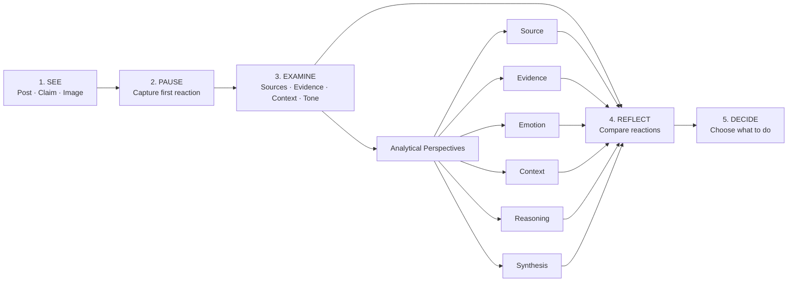
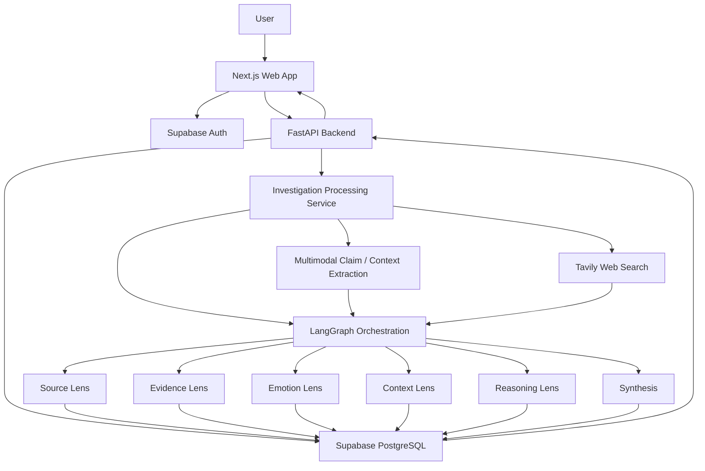

Second Thought
> **Think before you trust. Learn before you share.**
Second Thought is a human-centered Media and Information Literacy (MIL) workbook created for the UNESCO Youth Hackathon 2026 — “Play Your Part: Youth Designing the Future of Media and Information Literacy.”
Instead of telling people whether a post, message, image, or claim is true or false, Second Thought guides users through a structured process of slowing down, examining evidence and context, reflecting on their first reaction, and making their own informed decision.
---
1. UNESCO Youth Hackathon 2026
Theme
Play Your Part: Youth Designing the Future of Media and Information Literacy
The challenge is not simply helping people detect misinformation. Young people encounter enormous amounts of information and often have to make decisions before they have enough context to evaluate it.
Second Thought takes a different approach:
> **Don't build another truth detector. Build a better thinking habit.**
The product is designed around the idea that Media and Information Literacy should strengthen a person's ability to question, investigate, compare, reflect, and decide rather than replace their judgment with an automated verdict.
---
2. The Problem
Information can be misleading without being obviously false.
A social-media post may contain:
a real image with a misleading caption
a genuine statistic without its original context
emotionally charged language
an old event presented as recent
a real quote attributed to the wrong person
selective evidence
a mixture of accurate and unsupported claims
Traditional fact-checking interfaces can reduce the experience to:
TRUE / FALSE
That can create another problem: users may learn to trust the detector instead of learning how to investigate information themselves.
Second Thought focuses on the missing step:
The moment between seeing something and deciding what to do with it.
---
3. The Solution
Second Thought turns information verification into a guided critical-thinking journey.
A user can bring:
text
an image
text + image together
The system analyzes the submitted material, searches for relevant external evidence, organizes the findings, and presents them through a human-readable workbook.
The user moves through five stages:
```text
SEE → PAUSE → EXAMINE → REFLECT → DECIDE
```
The system provides evidence and reasoning support, but the final judgment remains with the user.
There is no authoritative truth score and no forced binary verdict.
---
4. How Second Thought Works

The six analytical perspectives
Source — Examines where information comes from and what kind of source it represents.
Evidence — Looks for supporting, challenging, uncertain, and missing evidence.
Emotion — Examines language and emotional framing that may influence how a person reacts.
Context — Looks for surrounding circumstances, timelines, entities, locations, and information that changes interpretation.
Reasoning — Examines how claims are constructed and whether conclusions follow from the available information.
Synthesis — Brings the investigation together into a concise qualitative understanding of what is supported, challenged, uncertain, or missing.
---
5. The User Journey
SEE — Encounter
The user encounters a claim, post, message, or image.
They can paste text, upload an image, or provide both.
PAUSE — First Reaction
Before seeing the investigation results, the user slows down and considers their initial reaction.
Example:
> **Before we look closer, what would make you trust this claim?**
This preserves the user's original thinking instead of immediately replacing it with an automated answer.
EXAMINE — Investigate
The submitted material is processed and investigated through multiple perspectives.
The system can:
extract visible text from images
identify claims and relevant entities
identify contextual clues
generate research queries
retrieve relevant external sources
compare supporting and challenging evidence
examine emotional or persuasive framing
identify uncertainty and missing context
REFLECT — Reconsider
The user sees the investigation in an editorial, human-readable format and compares the new information with their initial reaction.
Instead of:
> “The AI says this is false.”
Second Thought communicates:
> “Here is what we found. Here is what supports it. Here is what challenges it. Here is what remains uncertain.”
DECIDE — Make the Choice
The user decides what to do with the information.
Possible outcomes include:
wait and verify
share with context
do not share
remain unsure
The product does not make that decision for them.
---
6. Multimodal Investigation
Second Thought supports text, images, and both together.
Text only
```text
User claim
   ↓
Claim/context extraction
   ↓
Search + analytical perspectives
   ↓
Workbook
```
Image only
```text
Uploaded image
      ↓
Visible text + claim + entities + context extraction
      ↓
Search + analytical perspectives
      ↓
Workbook
```
Text + Image
```text
User text/context ─────┐
                       ├──→ Multimodal investigation
Uploaded image ────────┘
                              ↓
                     Search + analytical perspectives
                              ↓
                           Workbook
```
When text and an image are provided together, the user's description is retained as contextual information while the image is analyzed.
The system does not simply classify the image. It investigates what the image and accompanying claim are about.
---
7. Evidence Model
Second Thought intentionally avoids artificial confidence percentages and reputation scores.
Findings are organized qualitatively:
Supported — relevant evidence was found.
Challenged — claims conflict with available evidence.
Uncertain — available evidence is insufficient or conflicting.
Missing Context — information that could materially change interpretation is unavailable.
Sources are presented with descriptive classifications such as:
Official government source
Primary source / Academic research
Independent reporting
Secondary source
Users can open source details and inspect excerpts and links rather than being asked to trust an opaque score.
---
8. Product Philosophy
Second Thought is intentionally not:
an AI truth machine
a binary misinformation detector
a social-media moderation dashboard
a collection of confidence percentages
a replacement for human judgment
It is a thinking environment.
> **Evidence should improve someone's thinking, not replace it.**
---
9. Architecture

Core stack
Layer	Technology
Frontend	Next.js 16 · React · TypeScript · Tailwind CSS
UI	shadcn/ui + custom editorial components
Backend	Python 3.12 · FastAPI
Orchestration	LangGraph
Multimodal analysis	Gemini
Web search	Tavily
Database	Supabase PostgreSQL
Authentication	Supabase Auth
Frontend hosting	Vercel
Backend hosting	Render
---
10. Backend Processing Flow
```text
                    ┌────────────────┐
                    │ User submits   │
                    │ text / image   │
                    └───────┬────────┘
                            ↓
                 ┌─────────────────────┐
                 │ Validate request &  │
                 │ authenticate user   │
                 └──────────┬──────────┘
                            ↓
                 ┌─────────────────────┐
                 │ Extract claims,     │
                 │ text & context      │
                 └──────────┬──────────┘
                            ↓
                 ┌─────────────────────┐
                 │ Generate research   │
                 │ queries             │
                 └──────────┬──────────┘
                            ↓
                 ┌─────────────────────┐
                 │ Retrieve external   │
                 │ sources              │
                 └──────────┬──────────┘
                            ↓
             ┌──────────────┴──────────────┐
             ↓              ↓              ↓
        Source Lens    Evidence Lens   Emotion Lens
             ↓              ↓              ↓
        Context Lens   Reasoning Lens  Synthesis
             └──────────────┬──────────────┘
                            ↓
                 ┌─────────────────────┐
                 │ Human-readable     │
                 │ workbook findings  │
                 └──────────┬──────────┘
                            ↓
                 ┌─────────────────────┐
                 │ User reflects and   │
                 │ makes final choice  │
                 └─────────────────────┘
```
---
11. Data & Security
User investigations and thinking history are stored per authenticated account.
The backend uses authenticated requests and Supabase Row Level Security so users can only access or delete their own investigation records.
Credentials are kept outside source control using environment variables and deployment secrets.
`.env` files are excluded through `.gitignore`.
No API keys should be committed to the repository.
---
12. UX Principles
Second Thought deliberately uses a quiet editorial interface rather than a typical AI dashboard.
Visual language
warm, restrained surfaces
serif-led reading experience
charcoal typography
minimal motion
no decorative AI effects
no unnecessary gradients or glowing elements
no fake intelligence indicators
no excessive metric cards
Interaction language
The interface asks users to think, rather than telling them what to believe.
Examples:
> What would make you trust this claim?
> What would make you more confident in this claim?
> What did you notice?
> What would you do with this information?
---
13. Accessibility & Responsive Design
The application is designed for desktop, tablet, and mobile screens.
The investigation workspace includes:
collapsible history sidebar
individual investigation deletion
readable typography
responsive navigation
clear interaction states
The interface prioritizes readable content and understandable actions over visual complexity.
---
14. Project Features
Investigation
Text claims
Image claims
Text + image investigations
Automatic image text/context extraction
External source discovery
Multi-perspective analysis
Critical Thinking Workbook
SEE
PAUSE
EXAMINE
REFLECT
DECIDE
History
Persistent investigation history
Collapsible sidebar
Investigation titles
Individual investigation deletion
Authenticated ownership controls
Evidence
Supporting evidence
Challenged assertions
Uncertain information
Missing context
Source details and excerpts
Product Design
Editorial interface
Minimal motion
Responsive layout
Human-centered language
No binary truth verdicts
---
15. Testing & Production Readiness
The backend has been validated with the project test suite.
Backend: 39 tests passing.
The frontend production build has also been successfully compiled with TypeScript/Turbopack validation.
Current deployment architecture:
```text
Frontend  → Vercel
Backend   → Render
Database  → Supabase
```
---
16. Repository Structure
```text
second-thought/
├── frontend/
│   ├── app/
│   ├── components/
│   ├── lib/
│   └── ...
│
├── backend/
│   ├── app/
│   │   ├── core/
│   │   │   ├── langgraph/
│   │   │   ├── providers/
│   │   │   └── services/
│   │   ├── models/
│   │   └── routers/
│   ├── supabase/
│   │   └── migrations/
│   ├── tests/
│   ├── Dockerfile
│   ├── pyproject.toml
│   └── README.md
│
├── docs/
│   ├── architecture.md
│   ├── api-reference.md
│   └── local-development.md
│
└── README.md
```
---
17. Local Development
See:
`docs/local-development.md`
`docs/architecture.md`
`docs/api-reference.md`
`backend/README.md`
Frontend
```bash
cd frontend
npm install
cp .env.local.example .env.local
npm run dev
```
Backend
```bash
cd backend
uv sync
cp .env.example .env
uv run uvicorn app.main:app --reload --port 8000
```
---
18. Vision
Second Thought is built around a simple idea:
> **The goal is not to make people trust an AI more. The goal is to help people trust their own reasoning more.**
When information moves faster than reflection, the most valuable intervention may not be another verdict.
It may simply be a second thought.